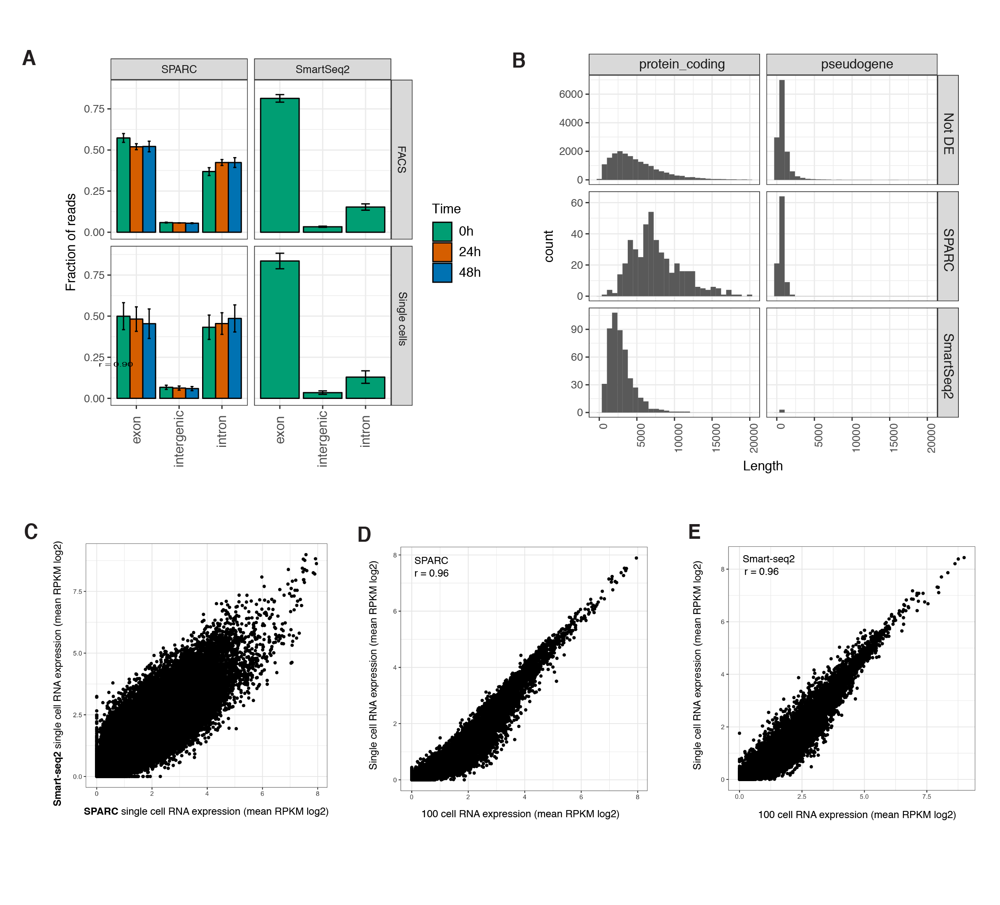

````{r setup, include=FALSE}

library(ggrepel)
library(kableExtra)
library(tidyverse)

library(ggpubr)
library(cowplot) 
library(gridExtra)


source("supplementaryFunctions.R")


cbPalette <- c("#FF0000","#0000FF", "#0072B2", "#F0E442" , "#CC79A7", "#999999", "#E69F00", "#56B4E9")

timePalette <- c("#009E73","#D55E00", "#0072B2","#000000", "#F0E442" , "#CC79A7", "#E69F00", "#56B4E9")
moleculePalette <- c("#FF0000","#0000FF")
cellCyclePallete <-c("#999999" , "#CC79A7", "#E69F00")

````


```{r load sampleInfo geneInfo and RNA expression matrix, include=FALSE}


sampleInfo = read.table(params$sampleInfo, sep = "\t", quote = "",
            header = TRUE, stringsAsFactors = FALSE)
geneInfo = read.table(params$geneInfo, sep = "\t", quote = "",
            header = TRUE, stringsAsFactors = FALSE)


lgRPKM.QC = read.table(params$RPKMInfo, sep = "\t", quote = "",
            header = TRUE, stringsAsFactors = FALSE)


# Remove all genes that is not expressed in at least 30
geneInfo.QC = geneInfo %>% 
  filter(external_gene_name %in% rownames(lgRPKM.QC))


```

```{r read the protein data , include=FALSE}


# read protein data:
proteinData <- read.table(file=paste(params$proteinData_QC, sep = "/"),sep="\t", header=T)

# add information in geneInfo if the genes have protein info or not. 


proteinDataDF = proteinData %>% gather(-1:-7, key = protein, value = Cq)


# Remove samples and proteins that are not expressed 
sampleInfoProtein = proteinDataDF %>% dplyr::group_by(Sample) %>%
  dplyr::summarize(proteinSampleSum = sum(Cq), proteinsFound = length(which(Cq > 0)))
geneInfoProtein = proteinDataDF %>% dplyr::group_by(protein) %>%
  dplyr::summarize(proteinSum_perGene = sum(Cq), proteinsFound_perGene = length(which(Cq > 0)))

```


```{r reduce the dataset  and merge so it only contains the genes and samples that have representation in both RNA and protein, include=FALSE}


# reduce to in only contains things in common with the two molecules. 
sampleInfo = sampleInfo[sampleInfo$ID %in% sampleInfoProtein$Sample, ]
geneInfo = dplyr::inner_join(geneInfoProtein,geneInfo.QC, by = c("protein" = "external_gene_name"))


# get RNA expression  
lgRPKM = lgRPKM.QC[rownames(lgRPKM.QC) %in% geneInfo$protein ,]
lgRPKM$geneID = rownames(lgRPKM)
RNAexpression =lgRPKM  %>% gather(-geneID, key = "sample",value = "lgRPKM")
RNAexpression = as_tibble(RNAexpression)


# get meta data for the RNA expression data 
expressionInfo = inner_join(RNAexpression, geneInfo,by = c("geneID" = "protein") )


# add protein metadata and Cq values to the expression data. 
proteinDataDF2 = proteinDataDF %>% dplyr::select(Sample,protein, cq_sum,nrDetectedGenes, Cq,type,time)
colnames(proteinDataDF2) = c("sample", "geneID", "cq_sum_per_sample","detected_proteins_per_sample","Cq" ,"type","time")
expressionInfo2 = inner_join(expressionInfo, proteinDataDF2)


sampleInfo =  sampleInfo %>% dplyr::rename(sample = "ID")
expressionInfo2 = left_join(expressionInfo2, sampleInfo )

expressionInfo2$RPKM = expressionInfo2$lgRPKM

expressionMatrix =  expressionInfo2 %>% select(geneID, sample, RPKM, Cq, time, type) 

write_tsv(file = params$protein_RNA_expression, x = expressionMatrix, col_names = T)

```


```{r filter sampels that are not found in both , include = FALSE }


expressionInfo3 = expressionInfo2 %>% select(geneID, sample, RPKM, Cq, time, type) %>%
  filter(type == "sc")


scatterPlots = list()

for(i in 1:length(geneInfo$protein)){
  protein = geneInfo$protein[i]
  expressionInfoSpec = expressionInfo3[expressionInfo3$geneID == protein,]
  scatterDensityPlotAll = scatterDensityPlot(expressionInfoSpec ,protein,timePalette)

  ggdraw(scatterDensityPlotAll)
  filename = paste(params$figuresDir, "scatterPlots",
                   paste(protein,"pdf", sep = "."),sep = "/")
 # #ggsave(filename,  width = 7, height = 7)
  scatterPlots[i] = list(scatterDensityPlotAll)

  scatterDensityPlot1 = scatterDensityPlot(expressionInfoSpec = expressionInfoSpec[expressionInfoSpec$time == "0h", ],protein,timePalette[1] )
    ggdraw(scatterDensityPlot1)
  filename = paste(params$figuresDir, "scatterPlots",
                   paste(protein,"0h","pdf", sep = "."),sep = "/")
  #ggsave(filename,  width = 7, height = 7)

  scatterDensityPlot2 = scatterDensityPlot(expressionInfoSpec = expressionInfoSpec[expressionInfoSpec$time == "24h", ],protein,timePalette[2])
  ggdraw(scatterDensityPlot2)
  filename = paste(params$figuresDir, "scatterPlots",
                   paste(protein,"24h","pdf", sep = "."),sep = "/")
  #ggsave(filename,  width = 7, height = 7)
  
  scatterDensityPlot3 = scatterDensityPlot(expressionInfoSpec = expressionInfoSpec[expressionInfoSpec$time == "48h", ],protein,timePalette[3])
  ggdraw(scatterDensityPlot3)
  filename = paste(params$figuresDir, "scatterPlots",
                   paste(protein,"48h","pdf", sep = "."),sep = "/")
  #ggsave(filename,  width = 7, height = 7)
  
    
}

```


```{r violin plot, include=FALSE}

#protein = "POU5F1"


violinPlots = list()
for(i in 1:length(geneInfo$protein)){
  protein = geneInfo$protein[i]
  plot = plotExpressionViolinPlot(expressionInfo2,protein, moleculePalette)
  plot
  
  filename = paste(params$figuresDir,"violinPlots",
                   paste(protein,"pdf", sep = "."),sep = "/")
  #ggsave(filename,  width = 7, height = 7)
  plot = plot + ggtitle(protein)+theme(axis.text.x = element_text(angle = 90, hjust = 1), text = element_text(size=7))+
    theme(axis.text.x = element_text(size = 7, angle = 90, hjust = 1, vjust = .5),
        axis.text.y = element_text(size = 7, angle = 0),  
        axis.title.x = element_text(size = 8),
        axis.title.y = element_text(size = 8),
        plot.title = element_text(size=10)) + 
    theme(legend.title = element_blank())
    
  violinPlots[i] = list(plot)
  
}


plot + ggtitle(protein)+theme(axis.text.x = element_text(angle = 90, hjust = 1), text = element_text(size=7))+
    theme(axis.text.x = element_text(size = 7, angle = 90, hjust = 1, vjust = .5),
        axis.text.y = element_text(size = 7, angle = 0),  
        axis.title.x = element_text(size = 8),
        axis.title.y = element_text(size = 8),
        plot.title = element_text(size=10)) + 
    theme(legend.position="none")      
```


```{r pseudo time  plot, include=FALSE}


 
pseudoTimeFigues = list()

for(i in 1:length(geneInfo$protein)){
  protein = as.character(geneInfo$protein[i])
  plot = plotPseudotime(expressionInfo2,protein, timePalette)
  plot = plot + labs(x = "pseudotime")+theme( text = element_text(size=7),axis.text.x = element_text(angle = 90, hjust = 1))+
    theme(axis.text.x = element_text(size = 7, angle = 90, hjust = 1, vjust = .5),
        axis.text.y = element_text(size = 7, angle = 0),  
        axis.title.x = element_text(size = 8),
        axis.title.y = element_text(size = 8),
        plot.title = element_text(size=10))
  
  plot
  filename = paste(params$figuresDir, "pseudotime",
                   paste(protein,"pdf", sep = "."),sep = "/")
  #ggsave(filename, width = 7, height = 7)
  pseudoTimeFigues[i] = list(plot)

}


#filename = paste(params$storageDir, "figures/pseudotime/pseudotime_multiple.pdf",sep = "/")
##ggsave(filename,,width = 4.51, height = 7.29)
```


# Supplementary figures

## Supplementary figure 1


**Figure S1: Characteristics of SPARC**

**(A)** Comparative characteristics of the single cell mapped sequencing reads (exon, intergenic, intron) for the SPARC versus Smart-seq2 protocol. Data is reported both for the reads originating from the single cell data and the FACS sorted 100 cell control data. **(B)** Annotation of differentially expressed genes detected via SPARC versus Smart-seq2. The genes preferentially detected with SPARC tend to be longer than the genes preferentially detected with Smart-seq2. The Not DE group represent the group of genes equally detected with both methods. **(C)** Single cell mean RKPM (log2) expression for all genes measured using either SPARC (x-axis) or Smart-seq2 (y-axis) (Pearson correlation coefficient r = 0.90) **(D)** Comparison of SPARC mean RKPM (log2) RNA expression reads for replicate FACS sorted 100 hESCs at 0h population (x-axis) or single cells (Pearson correlation coefficient r = 0.96). **(E)** Comparison of Smart-seq2 mean RKPM (log2) RNA expression reads for replicate FACS sorted 100 hESCs at 0h population (x-axis) or single cells (Pearson correlation coefficient r = 0.96). 


\pagebreak
## Supplementary figure 2
```{r  violin plots, echo=FALSE}
marrangeGrob(grobs = violinPlots, nrow=2, ncol=3) 
```


**Figure S2: RNA and protein gene expression violin plots**

Gene expression plots for the genes measured at both the level of protein (red) and RNA (blue). Results are shown for both the duplicate 100 cell control (black dots) and single cells (violin plots). The presented data is not normalized for cell cycle, the number of genes detected (RNA) or cumulative protein sums (protein). 


\pagebreak
## Supplementary figure 3


**Figure S3: Cell cycle and gene expression **

**(A-B)** Relationship between the predicted cell cycle phase (G1, S or G2/M) and **(A)** the per cell cumulative protein sum or **(B)** the number of detected genes. The cumulative protein sum was calculated by summing across all proteins measured (n = 92) per cell. **(C)** hESCs were labeled with the live cell Vybrant DyeCycle Violet DNA stain and sorted by DNA content into G1, S or G2/M phase. 100 cells in triplicate per cell cycle phase were processed for multiplex PEA analysis. Protein expression was compared between G2/M sorted cells and G1 sorted cells. The volcano plot shows the extent of the difference in expression between G2 and G1 cell cycle phases (x-axis) and significance of the difference (y-axis). The red line marks p-value 0.01. The blue lines mark 0.5 Cq difference between the cell cycle phases G2 and G1, or an approximate 1.5-fold difference. As expected, G2-specific proteins AURKA, CCNA2 and AURKB and G1-Gspecific protein CCNE1 show higher expression in G2 and G1 cell cycle phases, respectively.  The majority of protein show a mean 1.5 increase in protein amount in G2 versus G1, with some notable exceptions, including e.g. pluripotent factors NANOG and POU5F1.


\pagebreak
## Supplementary figure 4
```{r  Scatterplots, echo=FALSE}
marrangeGrob(grobs = scatterPlots, nrow=3, ncol=3)
```


**Figure S4: RNA and protein gene expression dot and density plots**
Combined dot and density plot of mRNA (log RPKM) and protein (Cq) expression in cells measured at 0h (green), 24h (orange) and 48h (blue). The presented data is not normalized for cell cycle, the number of genes detected (RNA) or cumulative protein sums (protein). 


\pagebreak
## Supplementary figure 5
```{r  PseudoTime, echo=FALSE, message=FALSE, warning=FALSE}
marrangeGrob(grobs = pseudoTimeFigues, nrow=3, ncol=3)
```

**Figure S5: RNA and protein gene expression in single cells as ordered by pseudotime**
mRNA (log RPKM) and protein (Cq) expression in cells ordered by pseudotime as determined by the RNA expression data. The presented data is not normalized for cell cycle, the number of genes detected (RNA) or cumulative protein sums (protein). 


\pagebreak
## Supplementary figure 6

```{r Supplemenatry fgure 6, echo=FALSE, message=FALSE, warning=FALSE}


Fig5a_data = read.table(file = params$supplementaryFigure6data, header = T, sep = "\t" )


textLocation = data.frame(
  x = c(min (Fig5a_data$lmRNA ) ,min (Fig5a_data$lmRNA )),
  y = c(max (Fig5a_data$lmRNA ) ,max (Fig5a_data$lmRNA )- ((max (Fig5a_data$lmRNA ) - min (Fig5a_data$lmRNA )) / 15))) 

  
#linearMod <- lm(lmRNA ~ lmProtein, data=Fig5a_data)
#summary(linearMod)


correlation = cor.test(Fig5a_data$lmRNA,Fig5a_data$lmProtein, 
                    method = "pearson")
text = c(paste("rho %~%", round(digits = 3, correlation$estimate)),
         paste("p <", round(digits = 3, correlation$p.value)))

ggplot(Fig5a_data, aes(lmRNA,lmProtein)) + geom_point()+ 
    geom_smooth(aes(colour = "Linear model"), method = "lm") + xlab("klRPKM") + ylab("kCq") + 
  geom_text_repel(data = subset(Fig5a_data ,protein %in% c("EPCAM","CASP3","NOTCH1", "SOX2", "TP53","POU5F1")),
             aes(x = lmRNA,y = lmProtein,  label = protein))+
  geom_label(data = textLocation, mapping = aes(x,y,label =text), parse = T, vjust = "inward", hjust = "inward")+ theme_bw()

```
**Figure S6: Analysis of agreement of mRNA or protein expression changes over time**

Agreement of changes of mRNA and protein abundances over the measured time points 0h, 24h and 48h at the level of RNA and protein. The plot shows the results of the linear model Cq(lRPKM)) =  0.49* lRPKM - 0.01 with a Spearman rank correlation coefficient (rho) of 0.48 (p-value 5,1*10-4). Each dot represents a measured gene. The measurements of NOTCH1, POUF51, SOX2, CASP3, EPCAM and TP53 are also identified by their names. 


\pagebreak
## Supplementary figure 7


**Figure S7: Pearson correlation distributions between TFs and known targets**

Pearson correlation distribution between transcription factors NOTCH1, POUF51, SOX2 and TP53 and  expressed mRNAs. The different distributions are based on if the mRNA are annotated as targets for the  TF in three different TF-target databases (**ChEA ChIPseq TFs**, **Enrichr TF-Gene Coocurrence**, **TRRUST TFs  2019**). mRNAs not present in any of the three databases are in the **No database** distribution. The  different columns describe what cells that were used, **all** or only cells in steady state(**SS**), and what  molecule was used, **protein** or **RNA**, to measure the TF concentration in the cell.  


\pagebreak
## Supplementary figure 8


**Figure S8: Pattern of gene expression variation**

Patterns of gene expression variation at steady-state in S-phase cells, G2/M-phase cells and all cells. First  column describes the relation between mean RNA expression mean (RPKM) and RNA expression variation  (CV2). Colors indicate variably (red) or stably (blue) expressed genes. Second column is similar to first, but  for protein. Third column are the normalized gene expression variation (residuals) at the RNA and protein  levels. Fourth column are simple additive models of RNA variation and estimated translation rate compared to protein expression variation. Spearman rank correlation coefficient (rho) is given for both  columns three and four.


\pagebreak

# Supplementary tables


```{r tables, include=FALSE}


table1 = read_tsv(file = params$supplementaryTable1data) %>%
  select(`Olink PEA oligo sequence number`, `Gene name`,`Uniprot ID`) %>%
  filter(!is.na(`Gene name`))
  


table2 = read_tsv(file =  params$supplementaryTable2data) 
table2 = data.frame(table2)
colnames(table3)[6] = colnames(table3)[4]
colnames(table3)[7] = colnames(table3)[5]
colnames(table3)[1] = "Transcription factor"
colnames(table3)[3] = "Number of targets"


table3 = read_tsv(file = params$supplementaryTable3data) 
table3 = data.frame(table3) 
colnames(table3)[c(2,4,6,8)]="All"
colnames(table3)[c(3,5,7,9)]="Steady-state"

```


## Supplementary table 1

```{r Supplemenatry table1, echo=FALSE, message=FALSE, warning=FALSE}

kbl(table1, longtable = T, booktabs = T, caption = "Supplementary table S1") %>%
kable_styling(latex_options = c("striped","repeat_header"))

```

\pagebreak


## Supplementary table 2

```{r Supplemenatry table3, echo=FALSE, message=FALSE, warning=FALSE}

table2[,4] = formatC(table2[,4], format = "e", digits = 2)
table2[,5] = formatC(table2[,5], format = "e", digits = 2)
table2[,6] = formatC(table2[,6], format = "e", digits = 2)
table2[,7] = formatC(table2[,7], format = "e", digits = 2)

table2_footnote <- data.frame(table2)
names(table2_footnote)[1] <- "Transcription factor"
names(table2_footnote)[3] <- "Number of targets"
names(table2_footnote)[6] <- names(table2_footnote)[4]
names(table2_footnote)[7] <- names(table2_footnote)[5]

names(table2_footnote)[2] <- paste0(names(table2_footnote)[2],"[note][note][note]", sep = " ")

P_ALL <- c(F,T,T,T,T,T,T,T,T,T)
R_ALL = !P_ALL
P_SS <- c(T,F,T,T,F,T,T,T,F,T)
R_SS <- !P_SS


kbl(table2_footnote, booktabs = T) %>%
  kable_styling(latex_options = c("striped"),font_size = 8) %>%
  add_header_above(c(" " = 3, "All[note]" = 2, "Steady-state[note]" = 2)) %>%
  add_header_above(c(" " = 3, "K-S test (p-value) [note]" = 4)) %>%
  column_spec(4, bold = P_ALL) %>% 
  column_spec(5, bold = R_ALL) %>% 
  column_spec(6, bold = P_SS) %>% 
  column_spec(7, bold = R_SS) %>% 
  add_footnote(
    c(
      "Kolmogorov Smirnov test to compare the distribution of absolute pearson correlation scores of transcription factor to known targets from database to absolute pearson correlation scores of transcription factor to all other genes for the two different molecules (Protein and RNA) and two set of cells  (All and Steady-state). The moluecule with the lowest p-value for each of the two sets is highlighted with bold. Distriubiton of scores are visualised in Supplementary figure 8",
      "All includes all single cells from 0h, 24h and 48h",
      "Steady-State includes all single cells from 0h",
      "ChEA: transcription factor regulation inferred from integrating genome wide ChIP X experiments.(PMID: 20709693)",
      "Enrichr: interactive and collaborative HTML5 gene list enrichment analysis tool.(PMID: 23586463 , 27141961)",
      "TRRUST v2: an expanded reference database of human and mouse transcriptional regulatory interactions.(PMID: 29087512, 26066708) "),
    notation = "symbol",threeparttable = T)


```
\pagebreak

## Supplementary table 3

```{r Supplemenatry table4, echo=FALSE, message=FALSE, warning=FALSE}

 
RLW_P_ALL <- c(T,T,F,T,T,T,T,T)
RLW_P_SS <- c(F,F,T,F,F,T,F,F)
P_P_ALL <- c(T,F,F,T,T,T,T,T)
P_P_SS <- c(F,F,T,F,F,F,F,F)
P_R_SS <- c(F,T,F,F,F,F,F,F)
names(table3)[2] <- "All[note]"
names(table3)[3] <- "Steady-state[note]"


kbl(table3, booktabs = T) %>%
  kable_styling(latex_options = c("striped"),font_size = 8) %>%
  add_header_above(c(" " = 1, "Protein" = 2, "RNA" = 2, "Protein" = 2, "RNA" = 2)) %>%
  add_header_above(c(" " = 1, "Regulatory link weights [note][note]" = 4, "Pearson correlation[note]" = 4)) %>%
  column_spec(2, bold = RLW_P_ALL) %>%
  column_spec(3, bold = RLW_P_SS) %>%
  column_spec(6, bold = P_P_ALL) %>%
  column_spec(7, bold = P_P_SS) %>%
  column_spec(8, bold = P_R_SS) %>%
  add_footnote(
    c("Genie3 gives the weights of the putative regulatory links, with higher weights corresponding to more likely regulatory links",
      "Bold values are the highest value for the two different molecules (Protein and RNA) and two set of cells (All and Steady-state)",
      "Bold values are the highest positive or negative correlation, dependent if the target is activated or repressed by POU5F1, for the two different molecules (Protein and RNA) and two set of cells (All and Steady-state)",
      "All includes all single cells from 0h, 24h and 48h",
      "Steady-State includes all single cells from 0h"
      ),notation = "symbol",threeparttable = T)


```

